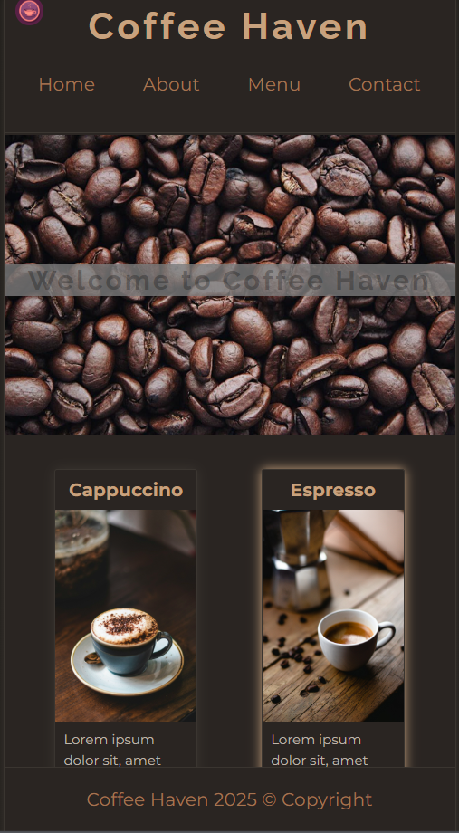

# ☕ Coffee Haven

A modern coffee shop website built with HTML, CSS, and JavaScript.

## Description

Coffee Haven is a stylish and fully responsive coffee shop website that showcases menu, contact information, and elegant visuals. Designed to reflect the cozy atmosphere of a real cafe.


## 🎨 Tech Stack
- HTML5
- CSS3
- Fonts: Montserrat & Raleway


## 🚀 Features
- Responsive design (mobile-friendly)
- Dark theme mode
- Menu categories: Espresso, Latte, Cappuccino, Desserts
- Contact page with working hours and address


## Structure
    ```markdown
    ## 🗂️ Project Structure
    coffee-haven/
    │
    ├── index.html         # Home page
    ├── menu.html          # Menu page
    ├── contact.html       # Contact page
    ├── about.html         # About page
    ├── images/            # Images
    ├── css/
    │   └── style.css      # Main styles
    └── js/
        └── main.js        # JavaScript logic

## Contact
## Email
- python2719@gmail.com

## 💡 Preview



## ⚙️ Setup
```bash
# Clone the repository
git clone https://github.com/samurai25/coffee-haven.git

# Open index.html in your browser

## 📜 License
This project is open source and available under the MIT License.
